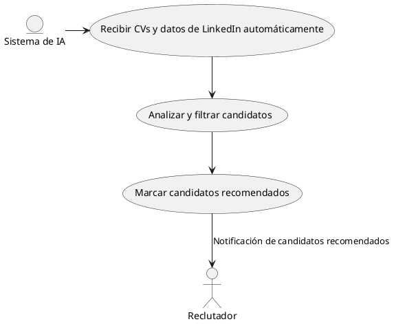
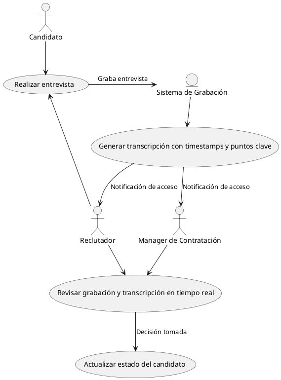
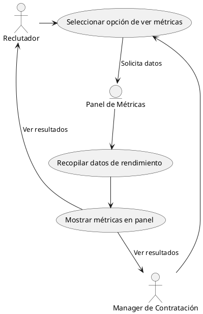
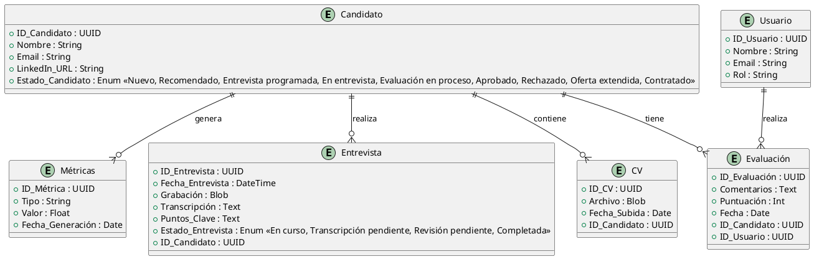
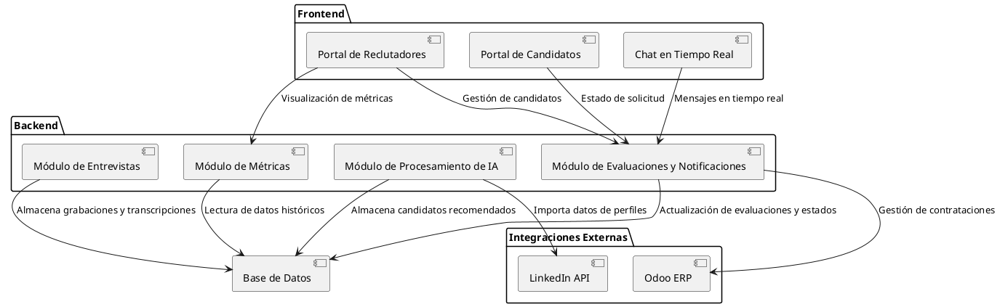
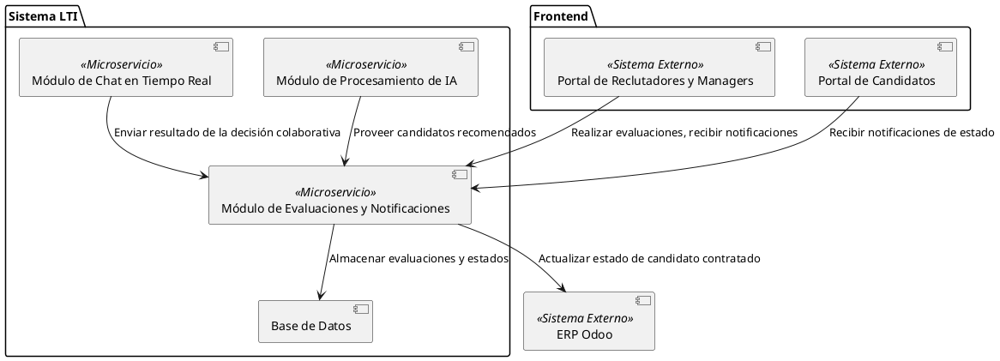
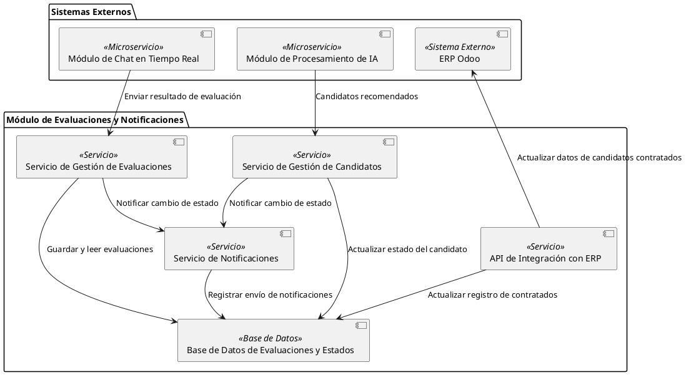
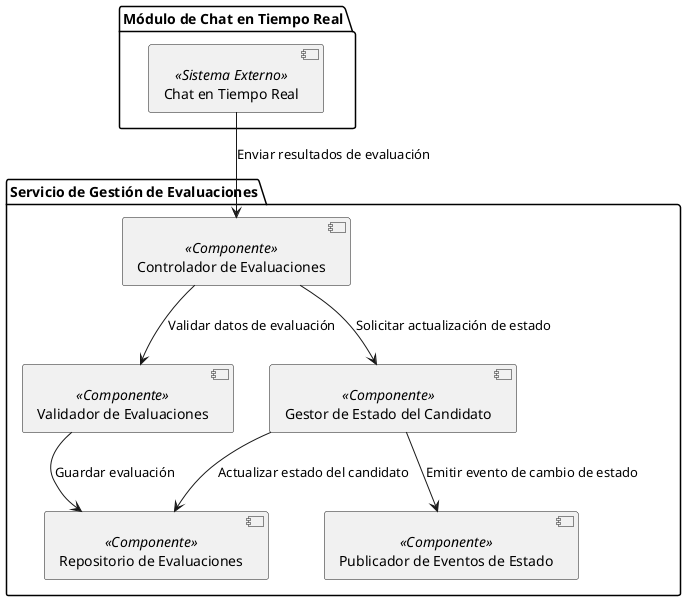
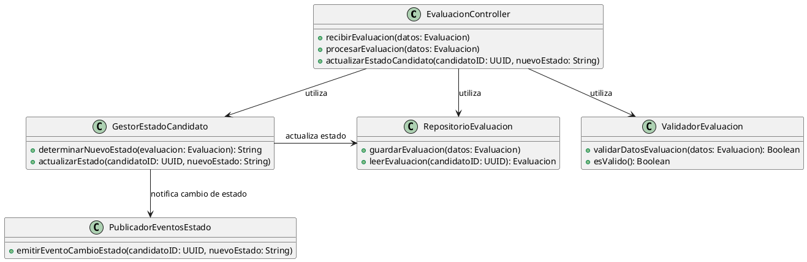

# Documento de Diseño del Sistema ATS de LTI

**Proyecto**: LTI - Applicant Tracking System (ATS)  
**Propósito**: Desarrollar un sistema de rastreo de candidatos enfocado en la eficiencia de reclutamiento, automatización, colaboración en tiempo real, y asistencia de IA.  
**Caso de Uso Principal**: Gestión de Entrevistas y Evaluación

---

# Índice

- [Descripción Breve del Software](#descripción-breve-del-software)
  - [Valor Añadido y Ventajas Competitivas](#valor-añadido-y-ventajas-competitivas)
  - [Funciones Principales](#funciones-principales)
- [Lean Canvas de LTI](#lean-canvas-de-lti)
- [Casos de uso](#casos-de-uso)
  - [Caso de uso 1: Filtrado Automático de Candidatos mediante IA](#caso-de-uso-1-filtrado-automático-de-candidatos-mediante-ia)
  - [Caso de uso 2: Colaboración en Tiempo Real para la Evaluación de Candidatos](#caso-de-uso-2-colaboración-en-tiempo-real-para-la-evaluación-de-candidatos)
  - [Caso de uso 3: Generación de Métricas de Rendimiento de los Procesos de Contratación](#caso-de-uso-3-generación-de-métricas-de-rendimiento-de-los-procesos-de-contratación)
- [Modelo de Datos](#modelo-de-datos)
- [Diseño del Sistema a Alto Nivel](#diseño-del-sistema-a-alto-nivel)
  - [Componentes Principales](#componentes-principales)
  - [Diagrama de Arquitectura](#diagrama-de-arquitectura)
- [Análisis C4](#análisis-c4)
  - [Nivel 1: Diagrama de Contexto del Módulo de Evaluaciones y Notificaciones](#nivel-1-diagrama-de-contexto-del-módulo-de-evaluaciones-y-notificaciones)
  - [Nivel 2: Contenedor del Módulo de Evaluaciones y Notificaciones](#nivel-2-contenedor-del-módulo-de-evaluaciones-y-notificaciones)
  - [Nivel 3: Componente del Servicio de Gestión de Evaluaciones](#nivel-3-componente-del-servicio-de-gestión-de-evaluaciones)
  - [Nivel 4: Clases y Métodos del Servicio de Gestión de Evaluaciones](#nivel-4-clases-y-métodos-del-servicio-de-gestión-de-evaluaciones)

---

# Descripción General del Sistema

**LTI** es un sistema de seguimiento de candidatos (ATS) diseñado específicamente para optimizar y transformar los procesos de contratación en pequeñas y medianas empresas (PYMES). Este sistema combina herramientas de automatización avanzadas, inteligencia artificial y funciones colaborativas en tiempo real para mejorar la eficiencia de los departamentos de recursos humanos, acelerar los procesos de selección y optimizar la colaboración entre reclutadores y managers de contratación.

## Valor Añadido y Ventajas Competitivas

El valor añadido de LTI radica en la combinación de un sistema simplificado y adaptable, específico para las necesidades de PYMES, y el uso de IA para optimizar tareas repetitivas y análisis de candidatos. Sus principales ventajas competitivas incluyen:

1. **IA para evaluación y filtrado inicial**: Mediante IA, LTI realiza una preselección automática de candidatos, evaluando habilidades, experiencia y aptitudes claves a partir de datos estructurados y no estructurados (como currículums y perfiles de LinkedIn).

2. **Colaboración en tiempo real**: Un chat integrado permite que reclutadores y managers interactúen en tiempo real, compartan opiniones y tomen decisiones colaborativas en una misma plataforma.

3. **Analíticas avanzadas y reporting**: El sistema ofrece un conjunto de métricas y reportes para evaluar el rendimiento de los procesos de contratación, como tiempos promedio de selección, tasas de aceptación de candidatos, y efectividad de canales de reclutamiento.

4. **Integración con LinkedIn y Odoo ERP**: LTI extrae datos de LinkedIn para la creación de perfiles de candidatos y facilita el contacto inicial con ellos, mejorando el alcance y la visibilidad de ofertas. Además, se integra con el ERP Odoo para la gestión del proceso de contratación, permitiendo un flujo eficiente desde la oferta hasta la incorporación del candidato.

## Funciones Principales

1. **Evaluación inicial mediante IA**: Escaneo y análisis automático de CVs y perfiles de LinkedIn para filtrar candidatos que cumplen con los requisitos esenciales.

2. **Chat colaborativo en tiempo real**: Permite la comunicación instantánea entre reclutadores y managers para discutir y evaluar candidatos.

3. **Métricas de rendimiento**: Panel de análisis de métricas, como tiempos de contratación y rendimiento de procesos, para mejorar continuamente la eficiencia del departamento de HR.

4. **Integración de datos**: Conexión directa con LinkedIn para la extracción de perfiles y contacto de candidatos, así como integración con el ERP Odoo para automatizar la administración de contrataciones y facilitar la gestión del ciclo completo del candidato.

---

# Lean Canvas de LTI

Aquí está el diagrama Lean Canvas propuesto para el modelo de negocio:

| **Sección**                  | **Descripción**                                                                                                                                                                    |
|------------------------------|------------------------------------------------------------------------------------------------------------------------------------------------------------------------------------|
| **Problema**                 | Procesos de contratación largos y poco eficientes en PYMES; falta de colaboración en tiempo real; dificultades en la evaluación inicial de candidatos                             |
| **Solución**                 | ATS optimizado para PYMES, que incluye IA para evaluación y filtrado de candidatos, chat colaborativo en tiempo real, y analíticas de rendimiento de procesos                     |
| **Métricas clave**           | Tiempos de contratación, precisión del filtrado de IA, interacciones colaborativas entre reclutadores y managers, efectividad de la integración con Odoo y LinkedIn               |
| **Propuesta de valor**       | Aumento de la eficiencia en contratación para PYMES mediante IA, automatización y colaboración en tiempo real, con analíticas avanzadas para la toma de decisiones               |
| **Ventaja competitiva**      | Especialización en el mercado PYME, IA avanzada para filtrado de candidatos, chat colaborativo y métricas integradas en una sola plataforma                                       |
| **Segmento de clientes**     | PYMES que buscan optimizar sus procesos de contratación y mejorar la experiencia de los candidatos a través de un proceso eficiente y basado en datos                             |
| **Canales**                  | Venta directa, partnerships con consultoras de recursos humanos, y marketing digital                                                                                              |
| **Estructura de costos**     | Desarrollo de IA y automatización, mantenimiento de la integración con LinkedIn y Odoo, hosting de la plataforma, soporte técnico                                                |
| **Flujo de ingresos**        | Suscripciones mensuales, tarifas por usuario (reclutador o manager), posible modelo de "pay-per-feature" para módulos adicionales de analítica avanzada o automatización premium |

---

# Casos de uso

## Caso de uso 1: Filtrado Automático de Candidatos mediante IA

### Descripción:
En este caso de uso, el sistema de IA procesa y filtra automáticamente los CVs y datos de LinkedIn de los candidatos sin la intervención del reclutador. Solo los candidatos que cumplen con los criterios establecidos son marcados como "Recomendados" y notificados al reclutador para una revisión más detallada.

### Actores:
- **Sistema de IA**: Realiza el análisis y filtrado de los candidatos.
- **Reclutador**: Recibe los candidatos que han pasado el cribaje inicial.

### Flujo:
1. El sistema de IA recibe automáticamente CVs y datos de LinkedIn de los candidatos.
2. La IA analiza y filtra los candidatos basándose en criterios predefinidos.
3. Los candidatos recomendados son marcados para revisión y se notifica al reclutador.
4. El reclutador revisa la lista de candidatos recomendados y toma decisiones sobre ellos.

### Diagrama UML:

## Caso de uso 2: Colaboración en Tiempo Real para la Evaluación de Candidatos

### Descripción:
Este caso de uso permite al reclutador y al manager de contratación analizar colaborativamente la entrevista del candidato mediante el acceso a la grabación, transcripción con timestamps y puntos clave generados automáticamente. Esto facilita la toma de decisiones en tiempo real y mejora la colaboración en la selección de candidatos.

### Actores:
- **Candidato**: Participa en la entrevista.
- **Reclutador**: Conduce la entrevista y participa en el análisis colaborativo posterior.
- **Manager de Contratación**: Revisa la grabación y transcripción para analizar el perfil del candidato junto con el reclutador.

### Flujo:
1. El candidato y el reclutador realizan la entrevista, que es grabada por el sistema.
2. El sistema genera una transcripción de la entrevista con timestamps y puntos clave.
3. El reclutador y el manager reciben una notificación con acceso a la grabación, transcripción y puntos clave.
4. Ambos actores revisan la entrevista y discuten observaciones en tiempo real en el chat colaborativo.
5. Una vez tomada una decisión, el estado del candidato se actualiza automáticamente en el sistema.

### Diagrama UML:

## Caso de uso 3: Generación de Métricas de Rendimiento de los Procesos de Contratación

### Descripción:
El sistema permite a los reclutadores y managers visualizar métricas clave del rendimiento del proceso de contratación, como tiempos de selección y efectividad de los canales de reclutamiento. Estas métricas ayudan a identificar áreas de mejora y optimizar los procesos futuros.

### Actores:
- **Reclutador**: Consulta las métricas para evaluar el rendimiento.
- **Manager de Contratación**: Accede a las métricas para analizar la efectividad del equipo y el proceso de contratación.

### Flujo:
1. El reclutador o manager selecciona la opción de ver métricas en el sistema.
2. El sistema recopila y procesa los datos de rendimiento.
3. Las métricas clave se muestran en un panel de análisis.
4. El reclutador o manager revisa los resultados y toma decisiones basadas en los datos.

### Diagrama UML:

# Modelo de Datos

## Entidades y Atributos

### Candidato
- **ID_Candidato** (UUID): Identificador único
- **Nombre** (String)
- **Email** (String)
- **LinkedIn_URL** (String)
- **Estado_Candidato** (Enum): Estado en el proceso de selección. Los estados propuestos incluyen:
    - `Nuevo`: Candidato ingresado en el sistema pero no revisado.
    - `Recomendado`: Candidato recomendado tras el filtrado inicial de IA.
    - `Entrevista programada`: Entrevista pendiente de realización.
    - `En entrevista`: La entrevista está en curso.
    - `Evaluación en proceso`: El candidato está en revisión y evaluación.
    - `Aprobado`: El candidato ha pasado todas las etapas.
    - `Rechazado`: El candidato ha sido descartado.
    - `Oferta extendida`: Se ha realizado una oferta al candidato.
    - `Contratado`: El candidato ha aceptado la oferta y completado el proceso.

### CV
- **ID_CV** (UUID): Identificador único
- **Archivo** (Blob): Archivo del CV
- **Fecha_Subida** (Date)
- **ID_Candidato** (UUID, Foreign Key): Relación con el Candidato

### Entrevista
- **ID_Entrevista** (UUID): Identificador único
- **Fecha_Entrevista** (DateTime)
- **Grabación** (Blob): Archivo de la grabación
- **Transcripción** (Text)
- **Puntos_Clave** (Text): Observaciones clave detectadas durante la entrevista.
- **Estado_Entrevista** (Enum): Representa el estado actual de la entrevista con valores como:
    - `En curso`: La entrevista está en proceso.
    - `Transcripción pendiente`: La grabación está lista, pero la transcripción está en proceso.
    - `Revisión pendiente`: La transcripción está lista y disponible para revisión.
    - `Completada`: La entrevista ha sido revisada y finalizada.
- **ID_Candidato** (UUID, Foreign Key): Relación con Candidato

### Usuario
- **ID_Usuario** (UUID): Identificador único
- **Nombre** (String)
- **Email** (String)
- **Rol** (String): Rol del usuario (Ej. "Reclutador", "Manager")

### Evaluación
- **ID_Evaluación** (UUID): Identificador único
- **Comentarios** (Text)
- **Puntuación** (Int): Puntuación dada al candidato
- **Fecha** (Date)
- **ID_Candidato** (UUID, Foreign Key): Relación con Candidato
- **ID_Usuario** (UUID, Foreign Key): Relación con Usuario

### Métricas
- **ID_Métrica** (UUID): Identificador único
- **Tipo** (String): Tipo de métrica (Ej. "Tiempo de Contratación", "Tasa de Rechazo")
- **Valor** (Float)
- **Fecha_Generación** (Date)

# Diseño del Sistema a Alto Nivel

## Componentes Principales

1. **Frontend**: La interfaz de usuario que permite a los reclutadores, managers y candidatos interactuar con el sistema.
    - **Portal de Reclutadores**: Para gestionar candidatos, visualizar métricas, y acceder al chat colaborativo y evaluaciones.
    - **Portal de Candidatos**: Permite a los candidatos revisar el estado de su solicitud y recibir notificaciones.
    - **Chat en Tiempo Real**: Módulo de mensajería en tiempo real para la colaboración entre reclutadores y managers.

2. **Backend**: Maneja la lógica de negocio, procesamiento de datos y comunicaciones entre los distintos componentes.
    - **Módulo de Procesamiento de IA**: Responsable de analizar y filtrar CVs y perfiles automáticamente.
    - **Módulo de Entrevistas**: Graba, transcribe y extrae puntos clave de las entrevistas.
    - **Módulo de Evaluaciones y Notificaciones**: Gestiona el estado del candidato, las evaluaciones y envía notificaciones a los usuarios según el flujo de estados.
    - **Módulo de Métricas**: Genera y muestra métricas clave para el análisis de rendimiento de los procesos de contratación.

3. **Integraciones Externas**:
    - **LinkedIn API**: Para importar y actualizar datos de los perfiles de candidatos.
    - **Odoo ERP**: Integración con Odoo para la gestión del proceso de contratación completo, desde la oferta hasta la incorporación.

4. **Base de Datos**: Almacena información estructurada de los candidatos, usuarios, entrevistas, evaluaciones y métricas.

5. **Notificación y Gestión de Estados**: Sistema de notificaciones en tiempo real que monitorea los estados del candidato y las entrevistas, y genera alertas para los actores correspondientes.

## Diagrama de Arquitectura

Aquí está el diagrama de alto nivel para visualizar la arquitectura del sistema y cómo se interrelacionan los componentes:

- **Frontend**: Proporciona las interfaces para los usuarios finales, con funcionalidades específicas para cada rol (reclutador, manager y candidato). La comunicación en tiempo real y el acceso a evaluaciones y métricas son fundamentales en el flujo de trabajo de los reclutadores y managers.

- **Backend**: Cada módulo del backend maneja una parte específica de la lógica de negocio. Por ejemplo:
    - El **Módulo de Procesamiento de IA** realiza el filtrado inicial de candidatos y se conecta a LinkedIn para extraer datos.
    - El **Módulo de Entrevistas** gestiona la grabación, transcripción y generación de puntos clave de las entrevistas.
    - El **Módulo de Evaluaciones y Notificaciones** permite gestionar estados y enviar notificaciones automáticas en función de las actualizaciones en el proceso de selección.
    - El **Módulo de Métricas** genera y almacena informes de rendimiento que los usuarios pueden consultar en el frontend.

- **Integraciones Externas**: La integración con LinkedIn y Odoo ERP facilita un flujo continuo desde la captación hasta la contratación del candidato.

- **Base de Datos**: La información central del sistema se almacena y se organiza para que los distintos módulos puedan acceder y procesar los datos de manera eficiente.

---

# Diagramas C4

## Nivel 1: Diagrama de Contexto del **Módulo de Evaluaciones y Notificaciones**

El **Módulo de Evaluaciones y Notificaciones** es una pieza fundamental del sistema LTI, diseñado para gestionar el estado de los candidatos, registrar las evaluaciones finales realizadas por los reclutadores y managers, y enviar notificaciones a los usuarios correspondientes. Este módulo interactúa con otros sistemas y componentes del sistema LTI para facilitar un proceso de selección eficiente y colaborativo.

### Funciones del Módulo de Evaluaciones y Notificaciones

1. **Evaluaciones de Candidatos**: Permite a los reclutadores y managers registrar el resultado final de las evaluaciones de candidatos, en base a la discusión y análisis colaborativo realizado en el chat en tiempo real.
2. **Gestión de Estados de Candidatos**: Administra el estado de cada candidato en el proceso de selección, incluyendo estados como "Recomendado", "Entrevista programada", "Evaluación en proceso", "Aprobado", "Rechazado", y "Contratado".
3. **Notificaciones a Usuarios**: Envía notificaciones automáticas a los usuarios (reclutadores, managers y candidatos) cuando ocurre un cambio de estado en el proceso de selección.
4. **Integración con ERP**: Actualiza el estado de los candidatos en el sistema ERP (Odoo) cuando el candidato es contratado, facilitando el proceso de incorporación en una sola plataforma.

### Explicación Detallada del Diagrama de Contexto

- **Portal de Reclutadores y Managers** (Frontend): A través de este portal, los reclutadores y managers interactúan con el Módulo de Evaluaciones y Notificaciones para registrar las evaluaciones finales y recibir notificaciones en tiempo real sobre los cambios de estado de cada candidato.

- **Portal de Candidatos** (Frontend): Permite a los candidatos ver el estado de su solicitud en tiempo real y recibir notificaciones cuando su candidatura progresa o cambia de estado.

- **Módulo de Chat en Tiempo Real**: Gestiona las grabaciones y transcripciones de entrevistas, así como la colaboración en tiempo real entre el reclutador y el manager. Una vez que ambos han alcanzado una decisión final sobre un candidato, el resultado se envía al Módulo de Evaluaciones y Notificaciones para su registro.

- **ERP Odoo**: El sistema ERP externo se conecta al Módulo de Evaluaciones y Notificaciones para actualizar el estado de los candidatos contratados, permitiendo un flujo continuo entre la selección y la incorporación.

- **Módulo de Procesamiento de IA**: Proporciona una lista inicial de candidatos recomendados tras un proceso de filtrado automático, dando inicio al flujo de evaluación dentro del Módulo de Evaluaciones y Notificaciones.

- **Base de Datos**: Contiene todos los datos necesarios para el funcionamiento del Módulo de Evaluaciones y Notificaciones, incluyendo los estados y evaluaciones finales de los candidatos, y garantiza la persistencia de los datos para futuras consultas y análisis.

## Nivel 2: Contenedor del Módulo de Evaluaciones y Notificaciones

El **Módulo de Evaluaciones y Notificaciones** forma parte del sistema LTI y está compuesto por varios servicios internos que colaboran para gestionar las evaluaciones de los candidatos, mantener y actualizar los estados a lo largo del proceso de selección, y enviar notificaciones automáticas a los actores correspondientes.

### Explicación Detallada de los Contenedores Internos

1. **Servicio de Gestión de Evaluaciones**:
    - Este servicio registra y actualiza los resultados de las evaluaciones realizadas por los reclutadores y managers. Al finalizar la discusión en el Módulo de Chat en Tiempo Real, el resultado de la evaluación se envía a este servicio, que almacena los comentarios y puntuaciones en la base de datos.
    - Además, el Servicio de Gestión de Evaluaciones puede actualizar el estado del candidato en función de las evaluaciones (por ejemplo, cambiando el estado a "Evaluación en proceso" o "Aprobado").
    - **Interacciones**:
        - Recibe resultados de evaluación desde el Módulo de Chat en Tiempo Real.
        - Actualiza el estado del candidato en la Base de Datos de Evaluaciones y Estados.
        - Notifica al Servicio de Notificaciones cuando se actualiza el estado del candidato.

2. **Servicio de Gestión de Candidatos**:
    - Este servicio administra el estado general del candidato a lo largo del proceso de selección, permitiendo cambios de estado basados en información actualizada del candidato (como recomendaciones automáticas de la IA) de manera independiente al Servicio de Gestión de Evaluaciones.
    - **Interacciones**:
        - Recibe candidatos recomendados desde el Módulo de Procesamiento de IA.
        - Actualiza el estado del candidato en la Base de Datos de Evaluaciones y Estados.
        - Notifica al Servicio de Notificaciones cuando hay cambios de estado relevantes.

3. **Servicio de Notificaciones**:
    - Este servicio se encarga de reaccionar a los cambios de estado generados por los Servicios de Gestión de Evaluaciones y Gestión de Candidatos, enviando notificaciones automáticas a los actores correspondientes (reclutadores, managers y candidatos). También registra cada notificación en la base de datos para auditoría y seguimiento.
    - **Interacciones**:
        - Recibe las solicitudes de notificación tanto del Servicio de Gestión de Evaluaciones como del Servicio de Gestión de Candidatos.
        - Registra las notificaciones enviadas en la Base de Datos de Evaluaciones y Estados.

4. **API de Integración con ERP**:
    - Facilita la comunicación entre el sistema LTI y el ERP Odoo para actualizar el estado de los candidatos contratados, lo que permite gestionar el proceso de incorporación. La API se comunica con Odoo al final del proceso de selección para transmitir los datos necesarios.
    - **Interacciones**:
        - Actualiza el estado de los candidatos contratados en el ERP Odoo.
        - Guarda el estado final en la Base de Datos de Evaluaciones y Estados.

5. **Base de Datos de Evaluaciones y Estados**:
    - Almacena los datos de evaluación, los estados de los candidatos y los registros de notificaciones. Esta base de datos garantiza que toda la información del Módulo de Evaluaciones y Notificaciones esté disponible para consultas y auditoría en el futuro.
    - **Interacciones**:
        - Almacena todas las evaluaciones, estados de candidatos y registros de notificaciones realizados por los servicios internos del módulo.

## Nivel 3: Componentes del Servicio de Gestión de Evaluaciones

El **Servicio de Gestión de Evaluaciones** es un componente fundamental dentro del Módulo de Evaluaciones y Notificaciones. Este servicio es responsable de registrar los resultados de las evaluaciones colaborativas realizadas entre el reclutador y el manager de contratación, y de actualizar el estado del candidato en función de estos resultados.

### Explicación Detallada de los Componentes Internos

1. **Controlador de Evaluaciones**:
    - Actúa como punto de entrada para las solicitudes de evaluación recibidas desde el Módulo de Chat en Tiempo Real. Procesa las solicitudes, valida los datos y envía la información a los subcomponentes correspondientes para su almacenamiento y actualización.
    - **Interacciones**:
        - Recibe resultados de evaluación desde el Módulo de Chat en Tiempo Real.
        - Envía los datos al Validador de Evaluaciones para su verificación.
        - Solicita al Gestor de Estado del Candidato que actualice el estado según el resultado de la evaluación.

2. **Validador de Evaluaciones**:
    - Asegura que las evaluaciones cumplen con los requisitos de integridad y consistencia antes de ser almacenadas. Verifica que cada evaluación contenga los datos necesarios, como la puntuación y los comentarios.
    - **Interacciones**:
        - Recibe los datos de evaluación del Controlador de Evaluaciones.
        - Guarda los datos de evaluación en el Repositorio de Evaluaciones tras la validación.

3. **Gestor de Estado del Candidato**:
    - Este componente actualiza el estado del candidato en función de los resultados de la evaluación. Por ejemplo, si el candidato recibe una evaluación positiva, su estado puede cambiar a "Aprobado". También puede decidir el próximo estado en función de reglas predefinidas del sistema.
    - **Interacciones**:
        - Recibe la solicitud de actualización de estado desde el Controlador de Evaluaciones.
        - Actualiza el estado del candidato en el Repositorio de Evaluaciones.
        - Notifica al Publicador de Eventos de Estado cuando se realiza un cambio de estado significativo.

4. **Repositorio de Evaluaciones**:
    - Responsable de las operaciones de lectura y escritura en la base de datos. Almacena las evaluaciones, los comentarios y las puntuaciones, así como los cambios de estado de los candidatos.
    - **Interacciones**:
        - Recibe y guarda los datos de evaluación desde el Validador de Evaluaciones.
        - Actualiza el estado del candidato tras una solicitud del Gestor de Estado del Candidato.

5. **Publicador de Eventos de Estado**:
    - Emite eventos al Servicio de Notificaciones cada vez que se actualiza el estado de un candidato, permitiendo que el sistema envíe notificaciones a los usuarios correspondientes.
    - **Interacciones**:
        - Recibe la notificación de cambio de estado desde el Gestor de Estado del Candidato y emite un evento para el Servicio de Notificaciones.

### Flujo General del Servicio de Gestión de Evaluaciones

1. El **Módulo de Chat en Tiempo Real** envía el resultado de la evaluación al **Controlador de Evaluaciones**.
2. El **Controlador de Evaluaciones** envía los datos al **Validador de Evaluaciones** para su verificación.
3. Tras la validación, el **Validador de Evaluaciones** guarda los datos en el **Repositorio de Evaluaciones**.
4. El **Controlador de Evaluaciones** también solicita al **Gestor de Estado del Candidato** que actualice el estado del candidato según el resultado.
5. El **Gestor de Estado del Candidato** actualiza el estado en el **Repositorio de Evaluaciones** y emite un evento de cambio de estado a través del **Publicador de Eventos de Estado**.
6. El **Publicador de Eventos de Estado** notifica al Servicio de Notificaciones sobre el cambio, desencadenando las notificaciones correspondientes.

## Nivel 4: Clases y Métodos del Servicio de Gestión de Evaluaciones

### Descripción Detallada de las Clases y Funciones

1. **EvaluacionController**:
    - **recibirEvaluacion(datos: Evaluacion)**: Método principal que recibe los datos de evaluación provenientes del Módulo de Chat en Tiempo Real.
    - **procesarEvaluacion(datos: Evaluacion)**: Coordina el flujo de validación y almacenamiento de la evaluación, llamando al Validador de Evaluación y al Repositorio de Evaluaciones.
    - **actualizarEstadoCandidato(candidatoID: UUID, nuevoEstado: String)**: Llama al Gestor de Estado del Candidato para actualizar el estado en función de la evaluación.

2. **ValidadorEvaluacion**:
    - **validarDatosEvaluacion(datos: Evaluacion)**: Verifica que los datos de evaluación contengan los campos necesarios como puntuación y comentarios.
    - **esValido()**: Devuelve `true` si la evaluación es válida, permitiendo su almacenamiento y procesamiento.

3. **GestorEstadoCandidato**:
    - **determinarNuevoEstado(evaluacion: Evaluacion)**: Define el próximo estado del candidato basándose en reglas de negocio.
    - **actualizarEstado(candidatoID: UUID, nuevoEstado: String)**: Actualiza el estado en la base de datos y emite un evento de cambio de estado a través del Publicador de Eventos.

4. **RepositorioEvaluacion**:
    - **guardarEvaluacion(datos: Evaluacion)**: Guarda los datos de la evaluación en la base de datos, asegurando su persistencia.
    - **leerEvaluacion(candidatoID: UUID)**: Recupera la evaluación de un candidato específico.

5. **PublicadorEventosEstado**:
    - **emitirEventoCambioEstado(candidatoID: UUID, nuevoEstado: String)**: Publica un evento de cambio de estado para que el Servicio de Notificaciones lo capture y notifique a los usuarios correspondientes.
